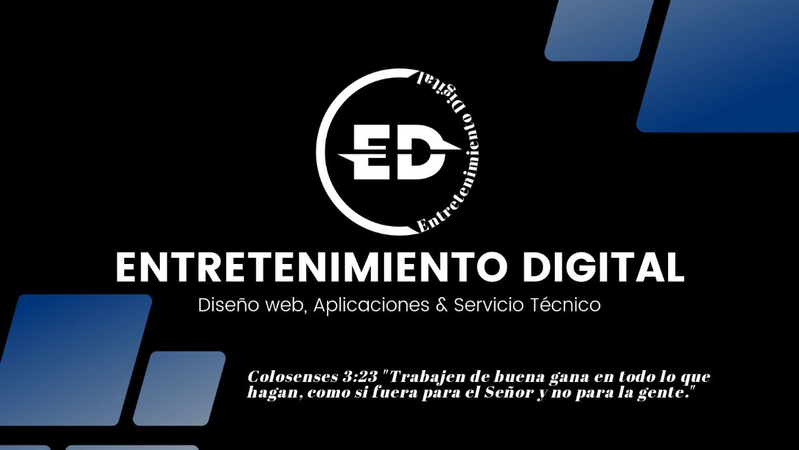

## 👨‍💻 Sobre Mí

Soy un <strong>Desarrollador Web</strong> y fundador de <strong>EDigital</strong>, una empresa dedicada a convertir visiones digitales en realidades de alto impacto. Desde 2018, combino creatividad, experiencia técnica y una gestión de proyectos eficiente para ofrecer soluciones web excepcionales a una cartera diversa de clientes. Actualmente, estoy expandiendo mi alcance y compartiendo mi conocimiento a través de contenido en video en mis redes sociales.

---

### 📬 Conecta Conmigo

  
  
  
  

---

### 🛠️ Stack Tecnológico

  

---

### 📊 Estadísticas de GitHub

   
  

 

  

